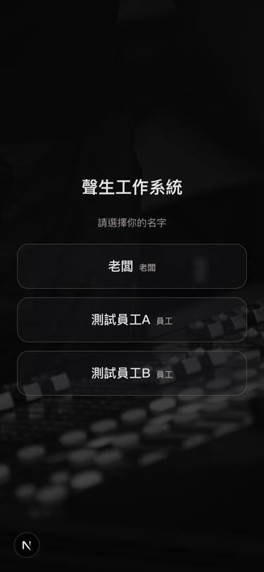
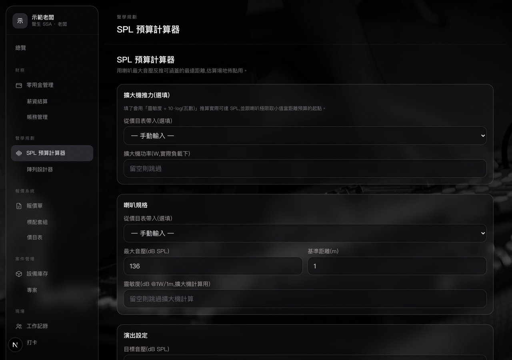
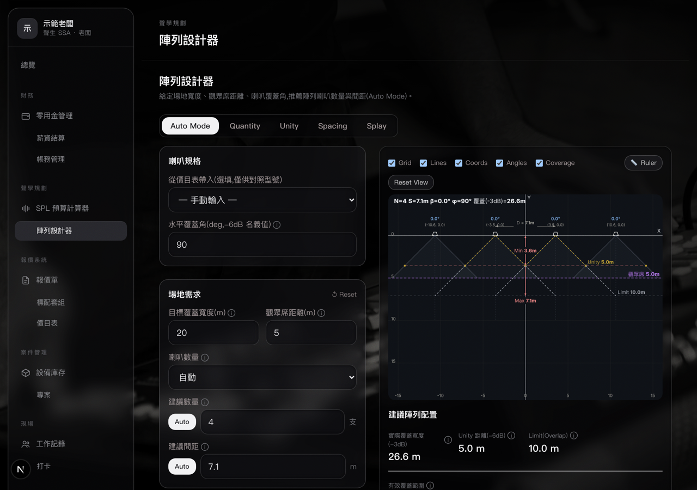

# wu-sound-fde

替雇主 Wu(音響工程公司)打造 AI-native 工作系統的 FDE 專案。

> **關於這個 public repo**:程式碼、規格、架構決策公開。
> 訪談紀錄、策略評估、給老闆的簡報等客戶端內部文件保留在本機,不進 git。

## 快速一瞥

| 員工手機(PWA) | 老闆桌機(聲學規劃) |
|---|---|
|  |  |
|  |  |

> 上圖以示範帳號截圖,無真實客戶/案場資料。

## 公司輪廓

- 業務線一「聲音工程」:初步瞭解客戶需求 → 聲學規劃/基礎聲學分析 → 報價 → 排程 → 施工
- 業務線二「租賃」:A. 純設備租賃(詢需求→報價配置→現場安裝);B. 同 A 但含 PA、燈光、舞台執行
- 規模:老闆 1 人 + 員工 3-5 人
- 老闆是唯一電腦使用者(報價、記帳、排程全是他);員工只用手機(打卡、零用金報備、工作記錄)
- 現行流程:口頭 + 人工填 Excel;客戶需求多為現場口頭詢問
- 改價權只在老闆,依案件規模 + 品項市場動態價,有歷史報價留存

## 設計憲章

1. **無靜默失效**:失敗要 loud,AI 只產草稿、每筆須人工確認才生效
2. **AI 隱形嵌入**:老闆對 AI 零認知,AI 藏在既有動作裡(語音/拍照 → 結構化資料),不要求任何人「學 AI」
3. **Deterministic 主軌 + LLM 副軌**:電學計算、帳務數字絕不由 LLM 產出
4. **比 Excel 少步驟**:任何流程若比現行 Excel 多兩步,老闆就會棄用

## 約束

- 預算:老闆只願付 API 費 → hosting 走免費層(Supabase + Vercel/Cloudflare 之類),AI 用 Claude API
- 無時程壓力
- 員工端不裝 App,用手機瀏覽器(PWA)

## 內容目標(每一塊要做到什麼)

### 員工端(手機 PWA)
三件套:打卡、零用金報備、工作記錄。**目標比 LINE 少步驟**,PIN 登入不裝 App。首頁預設「拍收據」(見上圖),拍完即存,AI 稍後自動辨識金額。

### 老闆端(桌機 + 手機)
把報價、記帳、聲學規劃、標案監測收攏成單一操作面板,AI 藏在動作裡:語音 → 需求單、拍照 → 收據、口述 → SPL 配置。**任何 AI 產出都是草稿,老闆按下確認才生效**。

### 聲學規劃工具
把老闆的口頭需求 →(NL 解析)→ 結構化參數 → SPL/陣列計算 → 可回饋修改的閉環。**電學計算走 deterministic,不交給 LLM**。
- **SPL 預算計算器**:用喇叭最大音壓反推可涵蓋的最遠距離,估算場地佈點用
- **陣列設計器**:給定場地寬度、觀眾席距離、覆蓋角,推薦陣列喇叭數量與間距(Auto Mode / Quantity / Unity / Spacing / Splay 五模式)

### 標案監測(tender-radar)
外部訊號(等標期壓縮、第幾次招標)自動收集,老闆端 zero-config 唯讀。

### 內外帳
最敏感一塊,規則:AI 只做 OCR/結構化草稿,金額必須人工核對。收據辨識雙 provider(Anthropic / Kimi vision),資料主權由老闆選擇。

## 進度

### ✅ Phase 1:員工手機三件套(已上線)
- PIN 登入、打卡、零用金報備、工作記錄
- PWA(manifest + iOS standalone,可加到主畫面當 App 用)
- 老闆手機 UI + 導覽效能改善(拿掉 layout 阻塞的 count query + 熱門路由 prefetch)

### ✅ Phase 2:設備庫存(已上線)
- 大型設備位置追蹤(庫房 / 案場 / 維修)

### ✅ Phase 3:報價系統(已上線)
- 報價單 + 品項庫 + AI 選設備入口
- 母版列印 + 全站暗色玻璃改版
- 價目表匯入 + 毛利 % 顯示
- 品項庫視窗鎖(避免誤改)

### 🟡 Phase 4:內外帳(進行中)
- ✅ 內帳結構化 + 月結零用金匯入
- ✅ 收據辨識雙 provider(Anthropic / Kimi vision)
- ✅ 收據辨識 prompt 強化:金額改成獨立第一步、零推理、常駐核對提醒
- 🟡 Kimi provider 的資料主權待老闆授權(收據照片是否可流出台灣)

### ✅ 聲學規劃工具(第一版上線)
- 桌機導覽 + SPL 計算器 + 陣列設計器
- 四步規格書已定案(nav / NL→params / spec-data / closed-loop)
- Array Designer UI 完整度目前 1/5,底層數學已全驗證(規劃中補完 5 分頁)

### ✅ 標案監測(tender-radar 老闆端)
- 讀取 tender-radar API 的唯讀新分類
- 標案卡片顯示每案訊號(等標期壓縮 / 第幾次招標)

### ✅ 管理與基建
- 使用者 / 案場 / 員工設定
- GitHub Actions:tsc + build
- 部署 SOP(見 [docs/deploy.md](docs/deploy.md))
- 7 篇架構決策紀錄(見 [docs/adr/](docs/adr/))

### ⏸ 後段候補:排程
雇主訪談中從未主動提及,非現階段痛點。若日後需要,掛在庫存 + 工作記錄之上即可。

## 目錄

- `web/` — Next.js app(老闆端 + 員工端 PWA)
- `supabase/` — schema migrations + edge functions
- `docs/` — 公開規格、ADR、UI conventions、聲學規劃與 Array Designer 設計文件、產品截圖
- `intake/` — 從雇主端收來的原始資料(Excel 實例、內外帳文件、歷史報價單…)。**不進 git 遠端、不外流**

## 架構決策紀錄

見 [docs/adr/](docs/adr/):

1. 收據金額推理優先(先識別金額、再推理其他欄位)
2. AI 永遠不設價格
3. AI provider 選擇是資料治理問題
4. 排程明確排除於範圍外
5. 打卡↔薪資結算走 Path A
6. Hosting 必須走免費層
7. PIN 認證給非技術員工

## Tech Stack

- Next.js (App Router) + TypeScript
- Supabase (Postgres + Auth + Storage + Edge Functions)
- Anthropic Claude API + Moonshot Kimi API(收據辨識雙軌)
- Vitest
- 部署:Vercel / Cloudflare 免費層
